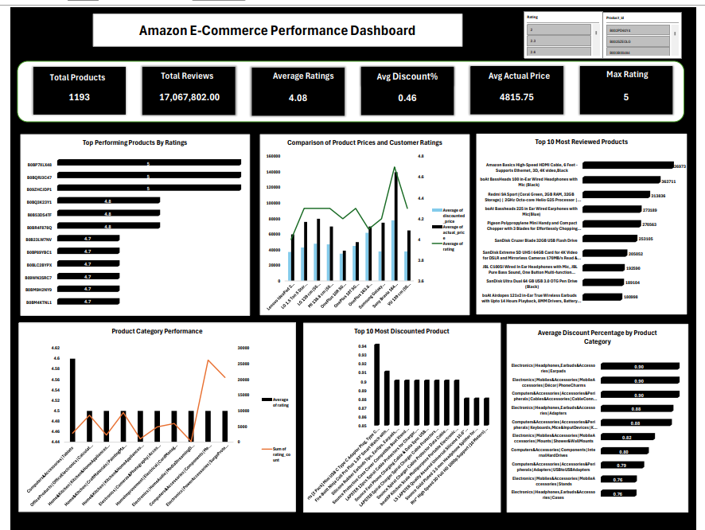

# Amazon E-Commerce Sales Analysis

## Project Overview

This project analyzes over 1,000 Amazon products to uncover insights into product performance, customer ratings, pricing strategies, and user engagement. Using Microsoft Excel, the dashboard highlights key trends that help understand product popularity, category performance, customer satisfaction, and discount patterns.

## Objectives

- Identify the highest-rated products.
- Compare actual prices, discounted prices, and customer ratings.
- Analyze product category performance.
- Identify the most reviewed and most popular products.
- Evaluate discount patterns across product categories.
- Generate business insights through interactive visualizations.

## Tools & Technologies

- Microsoft Excel
- Pivot Tables
- Pivot Charts
- Slicers
- Power Query

## Dashboard Features

- KPI Cards displaying:
  - Total Products
  - Total Reviews
  - Average Rating
  - Average Discount Percentage
  - Average Actual Price
  - Maximum Rating
- Top Performing Products by Rating
- Product Price vs. Customer Rating Analysis
- Top 10 Most Reviewed Products
- Product Category Performance
- Top 10 Most Discounted Products
- Average Discount Percentage by Product Category
- Interactive slicers for Product Category and Rating

## Key Skills Demonstrated

- Data Cleaning
- Data Transformation
- Power Query
- Pivot Tables
- Pivot Charts
- Dashboard Design
- Data Visualization
- Business Intelligence
- Exploratory Data Analysis

## Repository Contents

- Amazon E-Commerce Dashboard.xlsx
- CLEANED_DATA.csv
- DASHBOARD.png
- EXECUTIVE_SUMMARY.pdf

## Dashboard Preview

